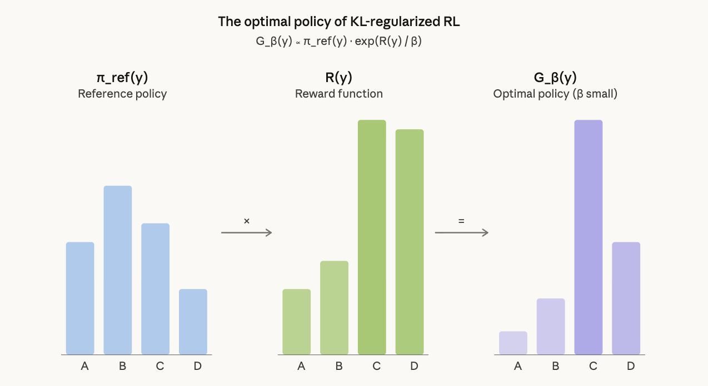

[← back](../index.html){.back}

# Why does Reverse KL encourage mode collapse in RL?

::: {.date}
April 4, 2026
:::

The optimal policy for reverse-KL regularized reward maximization has a closed form @silver2017mastering:

$$G_\beta(y) \propto \pi_\text{ref}(y) \cdot \exp\!\Big(\frac{R(y)}{\beta}\Big)$$

This is a Boltzmann distribution. The log probability ratio between any two sequences under this optimal policy is:

$$\log \frac{G_\beta(y_1)}{G_\beta(y_2)} = \log \frac{\pi_\text{ref}(y_1)}{\pi_\text{ref}(y_2)} + \frac{R(y_1) - R(y_2)}{\beta}$$

Two terms: the reference probability ratio and the reward difference scaled by $1/\beta$. Diversity collapse falls out of two special cases @silver2017mastering.

## Case 1: Equal support, different rewards

If $\pi_\text{ref}(y_1) = \pi_\text{ref}(y_2)$, the ratio simplifies to $\exp(\Delta R / \beta)$. Linear reward differences become exponential probability differences. At $\beta = 0.001$ (typical for GRPO), a reward gap of 0.1 yields a probability ratio of $\sim 10^{43}$. Only the single highest-reward mode survives.

## Case 2: Equal rewards, different support (standard RLVR)

If $R(y_1) = R(y_2)$ (binary pass/fail), the $\beta$ term cancels entirely:

$$\frac{G_\beta(y_1)}{G_\beta(y_2)} = \frac{\pi_\text{ref}(y_1)}{\pi_\text{ref}(y_2)}$$

The relative probabilities among correct answers are frozen at their pre-training ratios, independent of $\beta$. RL with equal rewards is a probability-preserving filter: it suppresses incorrect mass and redistributes to correct answers in proportion to their existing reference probabilities. No setting of $\beta$ fixes this.

## Combined effect

In standard RLVR (binary rewards, small $\beta$), both cases compound. The objective's globally optimal solution is, by construction, unimodal. Diversity collapse is not a failure of optimization — it is the correct solution to the problem as stated.

## Implication for dense rewards

A reward signal that assigns different scalar values to different correct solutions moves the problem from Case 2 (provably unimodal) into the general case where $\beta$ has leverage. Multimodal optimal solutions become possible when $\Delta R$ is small relative to $\beta \cdot \Delta \log \pi_\text{ref}$ (Remark 4.4 of GX-Chen et al., 2025). Dense rewards don't guarantee diversity, but binary rewards structurally forbid it.

## Note on forward vs. reverse KL

The standard intuition — reverse KL is mode-seeking, forward KL is mass-covering — comes from variational inference with restrictive approximating families (e.g., fitting a Gaussian to a multimodal target). LLMs are flexible enough to represent multimodal distributions. With a flexible family, both KL directions converge to the same global optimum. The diversity collapse comes from the shape of the target distribution, not the choice of KL direction. This is why switching GRPO's KL penalty from reverse to forward does not fix mode collapse.

    

