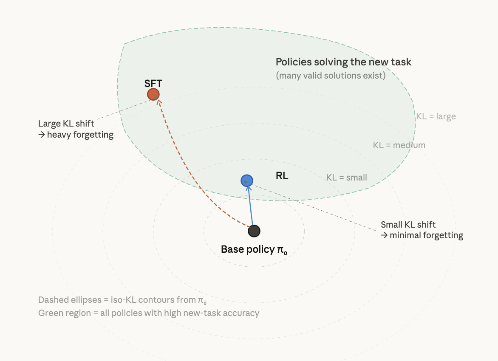
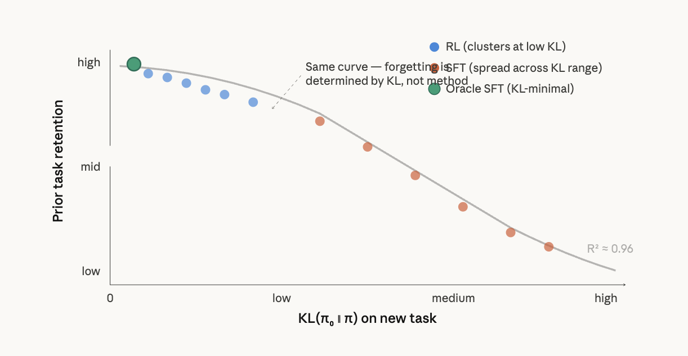
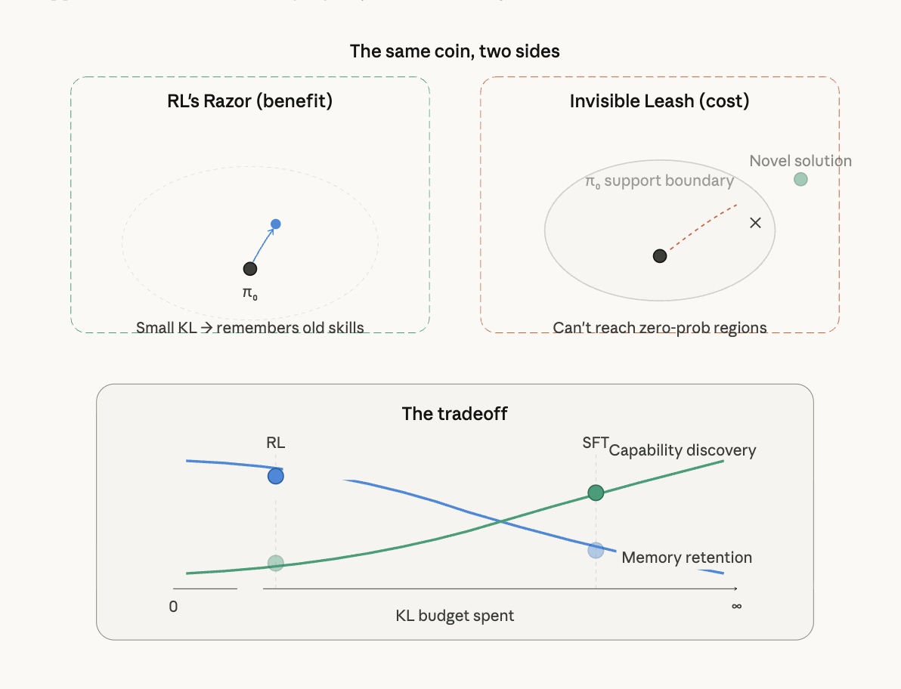

[← back](../index.html){.back}

# Why does RL not forget when SFT does?

::: {.date}
April 4, 2026
:::

We explore the RL's Razor @shenfeld2025rl. 

Great question — RL's Razor is one of the cleanest results in the forgetting literature and connects directly to the Invisible Leash constraint you've been thinking about for GLARE. Let me walk through the concept, then show where it breaks.

## The core principle

RL's Razor @shenfeld2025rl states: **among all policies that solve a new task equally well, on-policy RL is implicitly biased toward the solution closest in KL divergence to the original model.** This is why RL forgets less than SFT — not because RL is inherently different as an algorithm, but because on-policy sampling constrains the optimization to stay near the base model's distribution.

The mechanism is straightforward. When you do SFT, you're pulling the model toward an *external* target distribution — the labels provided by a human or teacher. That target can be arbitrarily far from the base model in KL space. There are typically many valid label distributions that achieve perfect accuracy on a task (think: "classify even vs. odd digits" — any mapping that assigns even digits to even labels works), and SFT has no preference among them. It converges to whichever one the labels happen to specify.

RL, by contrast, samples from the model's *own* distribution at every step. It can only reweight outputs that already have non-negligible probability mass. To improve reward, it gradually shifts the policy through small reweighting steps — never jumping to a distant distribution. Among the many policies achieving high reward, RL naturally converges to the one requiring the least distributional shift.

Here's the key finding that unifies everything:The key insight from the diagram: both SFT and RL land inside the green region (both achieve high accuracy on the new task). But SFT lands wherever the provided labels happen to point — potentially far from π₀ — while RL's on-policy sampling creates an implicit bias toward the *nearest* point in that region.

    

## The empirical forgetting law

Shenfeld et al. discovered something even stronger: forgetting isn't determined by whether you used RL or SFT at all. It's determined entirely by **KL(π₀ ∥ π) evaluated on the new task distribution**. When they plotted forgetting against this KL for both RL and SFT models across many hyperparameter settings, all points collapsed onto a single curve (R² = 0.96 in their controlled setting).

This means RL's advantage is not intrinsic to the algorithm — it's that on-policy updates happen to produce low-KL solutions. They validated this by constructing an "oracle SFT" distribution that analytically minimizes KL while achieving perfect accuracy. Oracle SFT actually *outperformed* RL on forgetting, confirming that the distribution learned — not the optimization method — governs forgetting.Both methods lie on the *same* curve. RL just happens to land at the left end. Oracle SFT can beat RL if you engineer the label distribution to minimize KL.

    

## Now break it: the Invisible Leash

Here's where RL's Razor becomes a double-edged sword. The same mechanism that prevents forgetting — staying close to π₀ in KL — is exactly the **Invisible Leash** (Wu et al., 2026; Yue et al., 2025). RL's KL-minimality bias means it cannot escape the base model's support.

The connection is direct: RL's Razor says "RL finds KL-minimal solutions → less forgetting." The Invisible Leash says "RL is KL-constrained → it cannot discover solutions outside π₀'s support." These are the *same property* viewed through different lenses.

    

## How this breaks

RL's Razor "breaks" in three specific ways:

**1. The support ceiling.** The Invisible Leash empirically shows that RLVR models consistently improve pass@1 but *degrade* pass@k for large k. Support shrinkage outweighs support expansion (NSCR values are consistently negative). RL concentrates mass on existing correct solutions rather than discovering new ones. The very KL-minimality that prevents forgetting *also* prevents genuine capability expansion.

**2. Oracle SFT beats RL.** If you can construct the KL-minimal label distribution, SFT achieves strictly less forgetting than RL at matched accuracy. RL's Razor is not a fundamental advantage — it's an approximation to the optimal strategy. Any method that more precisely targets the low-KL region of policy space can outperform RL on forgetting while potentially discovering solutions RL can't reach.

**3. Self-distillation offers a middle path.** The continual learning follow-up (Shenfeld, Damani et al., 2026) shows that on-policy self-distillation (SDFT) achieves *better* forgetting-vs-learning tradeoffs than either RL or SFT. The mechanism: on-policy sampling provides the KL-minimality bias (RL's Razor), while the teacher signal provides richer gradient information than binary reward. This is exactly the channel GLARE's reward head occupies — dense reward shaping that stays on-policy (mode-covering) while providing signal beyond what GRPO's binary reward can offer.

The punchline for your positioning: RL's Razor tells you *why* on-policy methods forget less, but it also reveals that on-policy RL is only an *approximation* of the ideal (KL-minimal + high-accuracy). GLARE's reward head, by providing dense calibrated signal within the on-policy framework, can potentially navigate the KL-accuracy frontier more efficiently than vanilla GRPO — staying at the low-KL end (preserving RL's Razor) while extracting more capability per unit of KL budget spent.